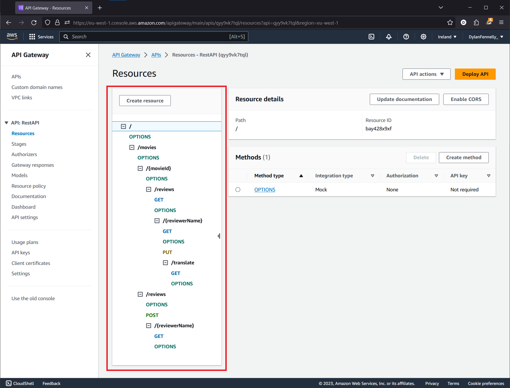
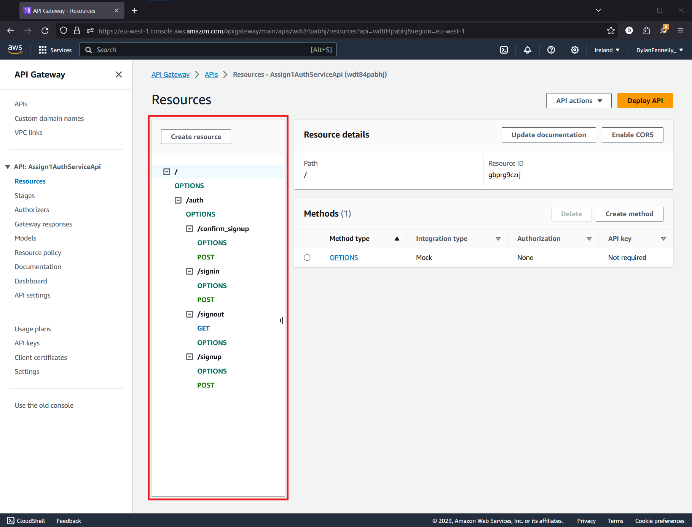
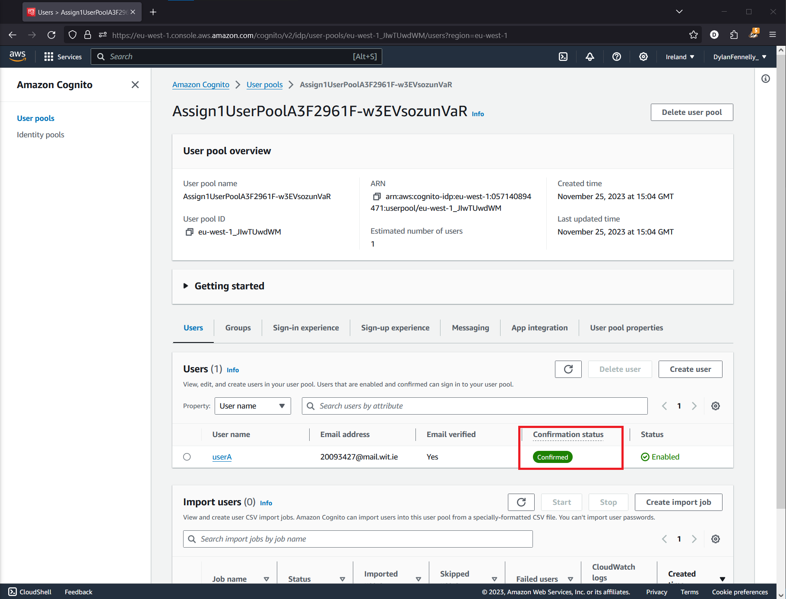

## ServerlessREST Assignment - Distributed Systems.

__Name:__ Dylan Fennelly

This repository contains the implementation of a serverless REST API for the AWS platform. A CDK stack creates the infrastructure. The domain context of the API is movie reviews.

### API endpoints.
 
__App API:__
+ POST /movies/reviews - Add a review to a movie. **[Requires Authentication]**
+ GET /movies/reviews/{reviewerName} - Get all reviews written by a specific reviewer (across all movies)
+ GET /movies/{movieId}/reviews - Get all reviews for a specific movie.
+ GET /movies/{movieId}/reviews?minRating=n - Get all reviews for a specific movie with a rating greater than or equal to the specified minimum rating.
+ GET /movies/{movieId}/reviews/{reviewerName} - Get a review for a specific movie written by an input reviwerName.
+ GET /movies/{movieId}/reviews/{year} - Get all reviews for a specific movie written during an input year.
    + This endpoint shares a lambda call with the above {reviewerName} endpoint, the input of which is determined through regex.
+ PUT /movies/{movieId}/reviews/{reviewerName} - Update a specific review's content. **[Requires Authentication]**
+ GET /movies/{movieId}/reviews/{reviewerName}/translate?language=xx - Translate a review's content into a specified langauge



__Auth API:__

+ POST /auth/signup - Register for an account.
+ POST /auth/confirm_signup - Confirm account registration with confirmation code.
+ POST /auth/signin - Sign into an account/authenticate.
+ GET /auth/signout - Sign out of an account/deauthenticate.



### Authentication..



### Independent learning (If relevant)

+ Researched additional DynamoDB commands, such as UpdateCommand and ScanCommand
    + Files of evidence:
        + lambda/updateMovieReview.ts
        + lambda/getAllReviewsByAuthor.ts

+ Researched composite DynamoDB keys
    + Files of evidence:
        + lib/app-api.ts

+ Researched DynamoDB filter expressions
    + Files of evidence:
        + lambda/getMovieReviews.ts

+ Researched AWS Translate functionality
    + Files of evidence:
        + lambda/translateReview.ts

+ Researched IAM premissions and roles:
    + Files of evidence:
        + lib/app-api.ts

### Steps to run
Requirements: 
+ Node.js installed
+ AWS CDK configured


1. Clone the repository
2. Navigate to the directory in a terminal and run the following commands:

```
npm install
npm run schema
cdk deploy
```


